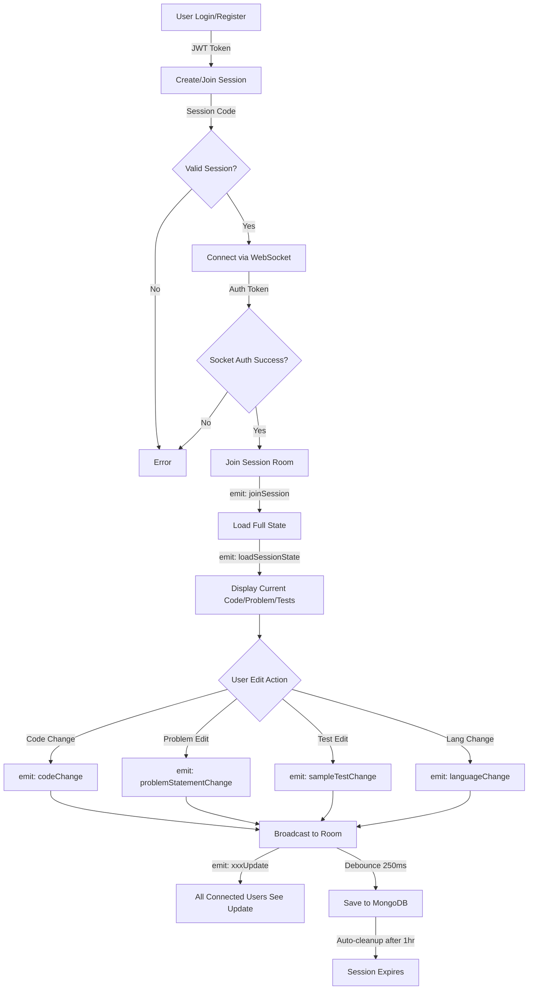

# Code-Meet 🚀

A real-time collaborative coding interview platform that enables interviewers and candidates to code together in a shared session with live synchronization and instant communication.

---

## 📋 Table of Contents

- [Live Demo](#live-demo)
- [Overview](#overview)
- [Features](#features)
- [Tech Stack](#tech-stack)
- [Prerequisites](#prerequisites)
- [Installation & Setup](#installation--setup)
- [Configuration](#configuration)
- [Running the Application](#running-the-application)
- [API Endpoints](#api-endpoints)
- [Project Structure](#project-structure)
- [Event Flow](#event-flow)
- [Security](#security)
- [Future Enhancements](#future-enhancements)

---

## 🎯 Live Demo

**Try it now**: [https://code-meet-6yb5.onrender.com/](https://code-meet-6yb5.onrender.com/)

> Note: First load may take 30 seconds as the Render free tier spins up the server.

---

## 📌 Overview

**Code-Meet** is a web-based platform for real-time collaborative coding interviews. Interviewers create sessions with unique codes, candidates join with those codes, and both can code together instantly. It's designed for technical interviews, pair programming, and live coding collaboration.

---

## ✨ Features

### Core Functionality
- **User Authentication**: Register and login with JWT-based authentication
- **Session Management**: Create unique coding sessions and join with session codes
- **Real-Time Code Collaboration**: Live code editing with instant synchronization between multiple users
- **Multi-Language Support**: Code in C++, Python, or Java with language-specific starter templates
- **Problem Statements**: Display problem descriptions and sample test cases
- **Session Persistence**: Auto-save code changes to database with debounced writes
- **Session Expiration**: Automatic cleanup of expired sessions after 1 hour
- **Responsive UI**: Clean, intuitive interface built with React and Vite

### Technical Features
- **WebSocket Integration**: Real-time bidirectional communication via Socket.IO
- **JWT Security**: Secure token-based authentication for both HTTP and WebSocket
- **Database Indexing**: TTL (Time-To-Live) indexes for automatic session cleanup
- **Debounced Saves**: Optimized database writes to prevent excessive Mongo queries
- **Error Handling**: Comprehensive error handling middleware and validation

---

## 🛠 Tech Stack

### Backend
- **Runtime**: Node.js
- **Framework**: Express.js (v5.2.1)
- **Real-Time Communication**: Socket.IO (v4.8.3)
- **Database**: MongoDB with Mongoose ODM (v9.3.0)
- **Authentication**: JWT (jsonwebtoken v9.0.3) + bcryptjs (v3.0.3)
- **Middleware**: CORS, dotenv for environment management
- **Development**: Nodemon for auto-reload

### Frontend
- **Library**: React (v19.2.4)
- **Build Tool**: Vite (v8.0.1)
- **Code Editor**: Monaco Editor (@monaco-editor/react v4.7.0)
- **Real-Time**: Socket.IO Client (v4.8.3)
- **HTTP Client**: Axios (v1.13.6)
- **Routing**: React Router DOM (v7.13.1)
- **Styling**: CSS3

---

## 📦 Prerequisites

Ensure you have the following installed on your system:

- **Node.js** (v16 or higher)
- **npm** (v8 or higher)
- **MongoDB** (v4.4 or higher, running locally or remote URI)
- **Git** (for version control)

---

## ⚙️ Installation & Setup

### Step 1: Clone the Repository

```bash
git clone https://github.com/Hello2025ayush/Code-Meet.git
cd Code-Meet
```

### Step 2: Install Backend Dependencies

```bash
cd backend
npm install
cd ..
```

### Step 3: Install Frontend Dependencies

```bash
cd frontend
npm install
cd ..
```

### Step 4: Configure Environment Variables

Create a `.env` file in the `backend/` directory:

```bash
# Server Configuration
PORT=5000

# Database Configuration
MONGO_URI="mongodb://localhost:27017/"

# JWT Secret (use a strong random string in production)
JWT_SECRET="your_super_secret_jwt_key_change_this_in_production"

# Frontend Origin (for CORS and Socket.IO)
FRONTEND_ORIGIN="http://localhost:5173"
```

**Important**: 
- Change `JWT_SECRET` to a strong random string before deploying
- Update `MONGO_URI` if using a remote MongoDB instance
- Ensure `FRONTEND_ORIGIN` matches your frontend URL

---

## 🚀 Running the Application

### Development Mode

**Terminal 1 - Start Backend Server:**

```bash
npm run dev
```

The backend will run on `http://localhost:5000` with auto-reload enabled via nodemon.

**Terminal 2 - Start Frontend Development Server:**

```bash
cd frontend
npm run dev
```

The frontend will be available at `http://localhost:5173`.

### Production Mode

**Build Frontend:**

```bash
cd frontend
npm run build
```

**Start Backend:**

```bash
npm start
```

---

## 🔌 API Endpoints

### Auth Routes (`/auth`)
- `POST /auth/register` - Create new account
- `POST /auth/login` - Login and get JWT token

### Session Routes (`/session`) - *Requires Authentication*
- `POST /session/create` - Create a new coding session
- `POST /session/join` - Join an existing session with code

### WebSocket Events

**Client to Server:**
- `joinSession` - Join a coding session room
- `codeChange` - Broadcast code changes
- `problemStatementChange` - Update problem statement
- `sampleTestChange` - Update sample test cases
- `languageChange` - Change programming language

**Server to Client:**
- `loadSessionState` - Load current session state
- `codeUpdate` - Receive code updates
- `problemStatementUpdate` - Receive problem updates
- `sampleTestUpdate` - Receive test updates
- `languageUpdate` - Receive language changes

---

## 📁 Project Structure

```
Code-Meet/
├── backend/
│   ├── config/
│   │   └── db.js                          # MongoDB connection
│   ├── controllers/
│   │   ├── auth.controller.js            # Auth logic (login/register)
│   │   └── session.controller.js         # Session logic (create/join)
│   ├── middlewares/
│   │   ├── auth.middleware.js            # JWT verification
│   │   ├── authSocket.js                 # WebSocket authentication
│   │   ├── errorHandler.js               # Global error handler
│   │   ├── validateSessionCode.js        # Session code validation
│   │   └── createSessionValidate.js      # Session creation validation
│   ├── models/
│   │   ├── session.model.js              # Session schema and model
│   │   └── user.model.js                 # User schema and model
│   ├── routes/
│   │   ├── auth.router.js                # Auth routes
│   │   └── session.router.js             # Session routes
│   ├── sockets/
│   │   └── editorSocket.js               # Real-time editor events
│   ├── utils/
│   │   └── generateSessionCode.js        # Unique session code generator
│   ├── .env                              # Environment variables
│   ├── .env.example                      # Environment template
│   ├── .gitignore                        # Git ignore rules
│   └── server.js                         # Main server file
│
├── frontend/
│   ├── src/
│   │   ├── components/
│   │   │   ├── CodeEditor.jsx            # Monaco editor component
│   │   │   ├── ProblemEditor.jsx         # Problem statement editor
│   │   │   ├── RoomLayout.jsx            # Main layout component
│   │   │   └── SampleTestEditor.jsx      # Sample test editor
│   │   ├── lib/
│   │   │   ├── api.js                    # API helper functions
│   │   │   ├── auth.js                   # Auth utilities
│   │   │   ├── config.js                 # Configuration
│   │   │   ├── editor.js                 # Editor configurations
│   │   │   └── socket.js                 # Socket.IO setup
│   │   ├── pages/
│   │   │   ├── CreateSessionPage.jsx     # Create session page
│   │   │   ├── JoinSessionPage.jsx       # Join session page
│   │   │   ├── LoginPage.jsx             # Login page
│   │   │   ├── RegisterPage.jsx          # Registration page
│   │   │   └── RoomPage.jsx              # Coding room page
│   │   ├── App.jsx                       # Main app component and routing
│   │   ├── main.jsx                      # React entry point
│   │   └── styles.css                    # Global styles
│   ├── index.html                        # HTML template
│   ├── vite.config.js                    # Vite configuration
│   ├── package.json                      # Frontend dependencies
│   └── .env                              # Frontend environment variables
│
├── package.json                          # Root package.json
└── README.md                             # This file
```

---

## � Event Flow



---

## 🔐 Security

- **JWT Authentication**: Secure token-based auth for API and WebSocket connections
- **Password Hashing**: Passwords encrypted with bcryptjs
- **Protected Routes**: Auth middleware on all session endpoints
- **CORS Enabled**: Secure cross-origin resource sharing
- **Environment Variables**: Sensitive data in `.env` files

---

## � Future Enhancements

**Coming Soon:**
- Code execution environment
- Video/Audio calling
- Real-time chat
- Session timeline chart


---

## 👨‍💻 Author

**Ayush Talreja**
- GitHub: [@Hello2025ayush](https://github.com/Hello2025ayush)


